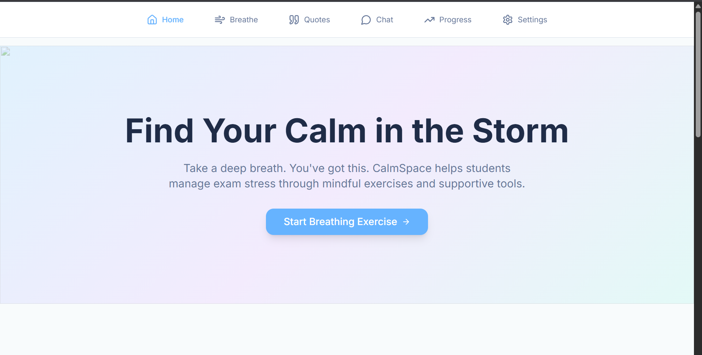
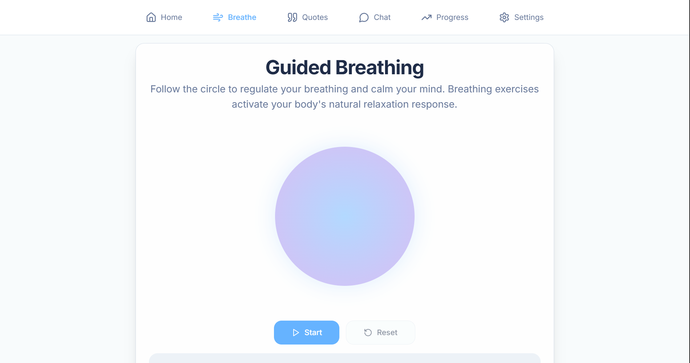
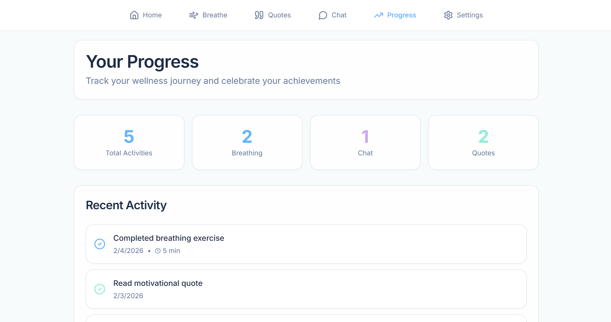
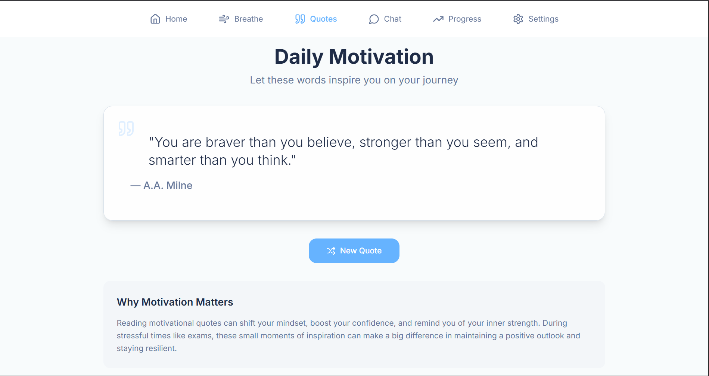

AI Stress Assistant Bot (Exam Ease) 🧠✨

Your personal AI companion for managing exam stress and mental well-being.

📌 Project Overview

AI Stress Assistant Bot is a full-stack web application designed to support students dealing with exam pressure. It combines computer vision for real-time emotion detection with a Large Language Model based empathetic chatbot to provide personalized encouragement and support.

The application acts as a supportive peer, offering breathing exercises, motivational quotes, and stress tracking powered by advanced AI technologies.

🚀 Features

🎭 Real-Time Emotion Detection
Uses webcam input with FER and DeepFace supported by MediaPipe.

🤖 Empathetic AI Chatbot
Powered by Groq (Llama 3.1) for natural emotional conversations.

🌬️ Breathing Exercises
Guided sessions to calm anxiety.

💬 Motivational Quotes
Positive affirmations to boost morale.

📈 Progress Tracking
Visual emotional trends over time.

🛡️ Privacy First
No video data is stored.

🛠 Tech Stack

Backend: Python, Flask, DeepFace, OpenCV, TensorFlow, Groq
Frontend: React, Vite, Tailwind CSS, Shadcn UI

📂 Folder Structure

AI-Stress-Assistant-Bot
backend — Flask server and ML logic
mindful-calm-buddy-main — React frontend
Screenshots — UI images
README.md — Documentation

⚙️ Installation

Clone:

git clone https://github.com/Nandha-0301/AI-Stress-Assistant-Bot.git

cd AI-Stress-Assistant-Bot

Backend:

cd backend
python -m venv .venv
.venv\Scripts\activate
pip install -r requirements.txt

Frontend:

cd ../mindful-calm-buddy-main
npm install
npm run dev

▶️ Run

Backend:

python app.py

Frontend:

npm run dev

📸 Screenshots

✍️ Author

Nandha
https://github.com/Nandha-0301

Built with ❤️ for student mental health.
